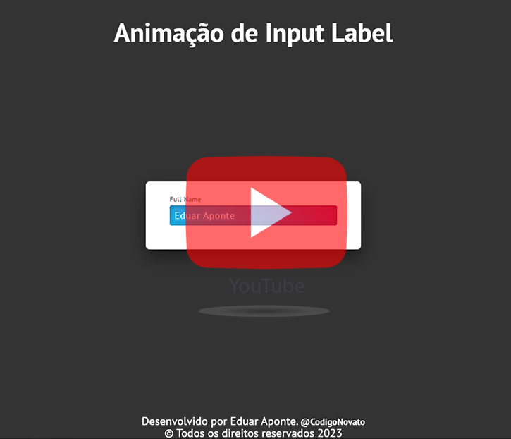

# Animacao Input HTML e CSS


Projeto criado com o objetivo de colocar em prática os conhecimentos em HTML, CSS.

<br>

<div align="center">

  
   
   
  

</div>

<br>

# Descrição

- Animação de input como fazer o texto placeholder flutuar quando o usuário digita no campo de formulário, transforme a experiência de preenchimento de formulários para seus usuários com a animação de input label!

### Declarando variáveis CSS globais.
- O :root pode ser útil para declarar uma variável CSS global.
- Exemplo:
```
:root {
  --cor-body: red;
  --pane-padding: 5px 42px;
}
```

### input
- O elemento HTML &lt;input&gt; é usado para criar controles interativos para formulários baseados na web para receber dados do usuário. A semântica de um  &lt;input&gt;  varia consideravelmente dependendo do valor de seu atributo
```
<!-- Um campo básico -->
<input type="text" name="input" value="Digite aqui">

```

### :valid
- A pseudo-classe CSS :valid representa qualquer  &lt;input&lt; ou outro elemento do  &lt;form&lt; cujo conteúdo foi validado com sucesso. Isso permite, facilmente, adicionar uma aparência que ajude o usuário a identificar os campos validados.
```
/* Seleciona qualquer input válido */
input:valid {
  background-color: powderblue;
}

```
- Quer conhecer mais visite os site de referência 

:root [Clique aqui](https://developer.mozilla.org/pt-BR/docs/Web/CSS/:root)
  
input [Clique aqui](https://developer.mozilla.org/pt-BR/docs/Web/HTML/Element/Input)
  
:valid [Clique aqui](https://developer.mozilla.org/pt-BR/docs/Web/CSS/:valid)
  
  
<br>

# Objetivo

O principal objetivo do projeto é colocar em prática os conhecimentos em CSS para dar estilos e animação no site.

<br>

# Ferramentas Utilizadas

- HTML
- CSS
- Visual Studio Code

<br>

# Como Testar

Você pode acessar o projeto [](https://animacao-input-lebel.netlify.app/) ou [](https://github.com/EduarAponte/Animacao-Input)

Ou rodar na sua maquina.

```

git clone https://github.com/EduarAponte/Animacao-Input.git

```

### Assitir o tutorial

<a href="https://youtu.be/lV8sA8DNmps" target="_blank">
  
</a>
<br>


# Observações

- Projeto para fim demonstrativo.

- o projeto esta construido utilizando as tecnologias HTML e CSS.
  <br>
  
> Status do projeto: Finalizado

<br>
O caminho das pedras para entrar no universo da programação e começar com a criação de sites utilizando as linguagens populares CSS, HTML e JavaScript.
